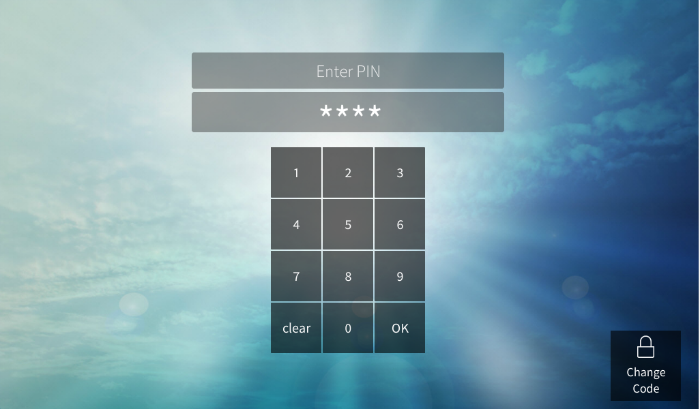

# crestron-passcode

SIMPL# Pro class to enable basic user authentication via PIN entry. 

Supports PIN up to 5 digits long. 





## How to use

Instantiate Passcode class and define a smartobject for the numeric keypad:
```c#
Passcode PIN = new Passcode();
SmartObject PasscodeKeypad;
```

Define the serial join number for the text field and digital join number for the 'Change Code' button that will be used on the UI:
```c#
private const uint passcodeTextField = 1234;
private const uint passcodeChangeButton = 1234;
```     

Initialise by passing the touch panel, keypad smartobject, change code join and text field join to PIN.Init and set up callback function:
```c#
PIN.Init(TP, PasscodeKeypad, passcodeChangeButton, passcodeTextField);
PIN.debug_enable = true;
PIN.SetCallback(PINCodeEntered);
```


When the correct passcode is entered, the callback function is fired:
```c#
private void PINCodeEntered()
{
    CrestronConsole.PrintLine("Correct PIN entered!");
}

```
Refer to the example solution and UI file. 

## Contributing
Pull requests are welcome. 


## License
[GPL-3.0](https://choosealicense.com/licenses/gpl-3.0/)
